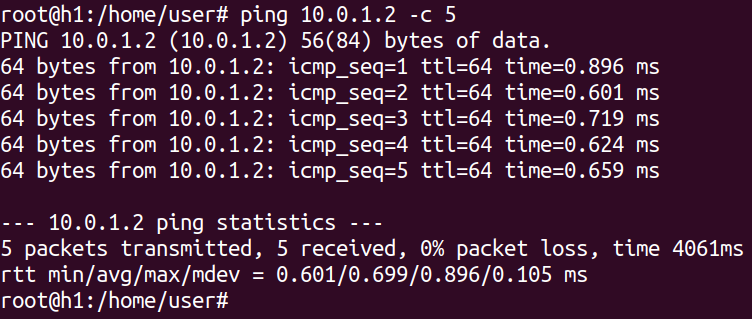

# Connectivity over a LAN

## Abstract

In the following contents, we will discuss about basic connectivity over a LAN. We aim at investigating some miss-configurations and demistifing OSes' beahviour whenever something out of normal context shows up.

## Configuration

Given the following topology, we will refer to each as H1 (`10.0.1.1/25`), H2 (`10.0.1.2/25`), and H3 (`10.0.1.3/25`). Each host is therefore belonging to the same Ethernet-based LAN.

<p align="center">
  
</p>

## `ping` command

`ping` is a command-line software by which you can craft ICMP messages. ICMP messages (echo-requests, and echo-replies) are normally adopted for network debugging and troubleshooting. 

<p align="center">
  
</p>

The ICMP packet is comprised of a header (8 bytes) and a variable payload. Since the most used network layer protocol is IPv4, the overall size of an ICMP packet can not overflow __65.536 bytes__. Without options, `ping` creates an ICMP echo-request per second. The receiver is expected to send back an echo-reply. Here it is an output when pinging H2 from H1:

<p align="center">
  
</p>

## Quickstart

When hitting `ping <target>`, from user-space the host is requesting the OS to put an ICMP echo-request into an IPv4 packet. The kernel handles the rest, and we don't care at the moment.
The ICMP payload size is 56 bytes. However, 8 out 56 bytes are used to have a timestamp in the packet, so that the sender can compute the __RTT__: how long it awaits before getting back a reply.

If sending the default ICMP echo-request packet, the overall size of the PDU which is going to be encapsulated in Ethernet is therefore 84-bytes long: 20 bytes (IPv4 header) + 8 bytes (ICMP header) + 56 bytes (ICMP payload). You see this result in the first output line, that is `56(84) bytes of data`.

<p align="center">
  
</p>


Alongside the __Type__ and the __Code__, the ICMP header also contains the __Identifier__ (16 bit) and the __Sequence Number__ (16 bit). These fields are written at user-space before requesting the OS to inject the ICMP buffer into an IPv4 packet, so the presentation may change according to the CPU endianess. As a result, Wireshark shows up both presentations. Here it is an ICMP packet dump on H2:

<p align="center">
  
</p>

The __Identifier__ tells the OS which process is awaiting for replies, so it plays the role of a process identifier, while the __Sequence Number__ helps the sender to match the replies the OS is delivering in user-space.

In the end, `ping` tells you the RTT of any ping-pong. The RTT as follows: when the sender puts an echo-request on the wire, it stamps the current time in the ICMP payload; when the receiver gest the echo-request, it copies the payload in the echo-reply; when the sender gets the echo-reply, it subtract the timestamp from the current time.

<p align="center">
  
</p>

### Quora

1) _What are the numbers `X`, `Y`, `Z` in the following output?_

```sh
H1: ping H2 -c 4
PING H2 (H2) X(Y) bytes of data.
Z bytes from H2: icmp_seq=1 ttl=64 time=18.6 ms
Z bytes from H2: icmp_seq=2 ttl=64 time=0.127 ms
Z bytes from H2: icmp_seq=3 ttl=64 time=0.127 ms
Z bytes from H2: icmp_seq=4 ttl=64 time=0.125 ms
--- H2 ping statistics ---
4 packets transmitted, 4 received, 0% packet loss, time 2999ms
rtt min/avg/max/mdev = 0.125/4.758/18.656/8.024 ms
```
2) _How can the ping application report the `icmp_seq` ? Why there is such a header? What could happen if such header were not present?_

3) _What is the `ttl` value? Is is the sender or receiver TTL? Who decide to use 64?_

4) _What does it change if you change the size of the requests using the `–s<size>` option? Which is the minimum size that allows ping to measure and report the `time` field? Why this is happening?
If you were the programmer working on the implementation of a ping command, how would you implement the `time` measure?_

5) _What happens if H1 tries to ping a host that is not active but belonging to your subnet?_

5) _What happens if H1 tries to ping a host that is not active and does NOT belong to your subnet? Is there any packet sent on the LAN? Which packets are those?_
