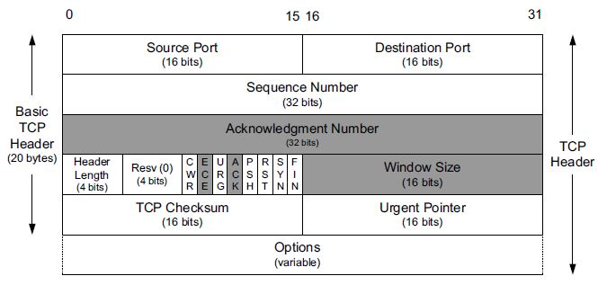
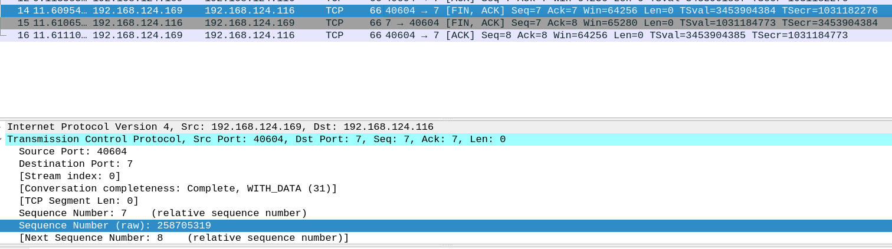

# TCP protocol testing, and sessions troubleshooting

To use trasport protocol, we need some application running at the application layer at the server-side, which is "listening" for possible requests from clients. To do so, use __inetd__, i.e. a super-server daemon on many Unix systems that provides Internet services: you can find the config file at /etc/inet.d on your Linux distro, e.g. Ubuntu; however, we are going to use the most recent version, i.e. __xinetd__.

The [ECHO](https://en.wikipedia.org/wiki/Echo_Protocol) is a service in the Internet Protocol Suite defined in RFC 862. The server sends back an identical copy of the data it received, likwise the traditional command line line **echo**. We are going to use such as service to discover TCP basics features.

The [CHARGEN](https://en.wikipedia.org/wiki/Character_Generator_Protocol) is a service of the Internet Protocol Suite defined in RFC 864 in 1983 by Jon Postel. It is intended for testing, debugging, and measurement purposes. The protocol is rarely used, as its design flaws allow ready misuse. Upon opening a TCP connection, the server starts sending arbitrary characters to the connecting host and continues until the host closes the connection. We are going to use such a service in a more advanced test.

<p align="center">
  
</p>

We started CHARGEN service on port 7, while Echo has been started on port 19. They both use TCP as trasportation layer, which is a stream-oriented protocol.

<p align="center">
  
</p>

To avoid any potential offloading, we need to disable some advanced functionalities that modern linecards implement. This can be done as follows:

<p align="center">
  
</p>

### TCP connection setup (ECHO service)

<p align="center">
  
</p>

When a client wants to converse with a server using TCP, the client's TCP module generates a SYN packet. This packet notifies: the port number (__Souce Port__) on which the application listens at level 7, the __Sequence Number__ that the client will use to number the bytes it will send to the server, the size of the reception window (__Window Size__), i.e. how many bytes the client can receive at once before the server is has to stop.

Theoretically, a TCP packet has no limit in terms of final size; however, from the IPv4 level, it is known that the maximum size is 65536 bytes and therefore, if IPv4 is used, the __MSS__ (Maximum Segment Size) has a very precise value. Furthermore, since we want to avoid the involvement of IP fragmentation (not so optimized), the actual MSS is much lower and depends on the MTU configured on the network card. Modern TCP connection uses the __Options__ section, by announcing how many bytes an incoming TCP packet should be.

The client (192.168.124.169) sends a SYN packet to the server (192.168.124.116). Notice that the client application is **telnet**. Telnet is listening on port 50186, i.e. a not privileged port. The client's TCP module selects the sequence number randomly, i.e. either 3374335068 (real number in the packet) or 0 (relative number), while the acknowledgment number is set to zero. This is because the client is awaiting the first bytes (0-based counting) from the server. Moreover, it tells the server the MSS in the Options filed, i.e. 1460 bytes.

<p align="center">
  
</p>


The server replies with a SYN-ACK packet to the client, which is a TCP packet with both flags SYN and ACK set to one. Please note: packets that contain the active ACK flag are all packets that acknowledge the receipt of any other TCP packet, even if this does not contain any data. Also the server wants to converse with the client, and this is why there is also the SYN flag set to one. The server's TCP module selects the sequence number randomly, i.e. either 286369255 (real number in the packet) or 0 (relative number), while the acknowledgment number is 3374335068 (the client's sequence number) + 1. The server is telling for which number it will count the next bytes, by its own sequence number, and which is the next bytes it is waiting for: if the client has sent 3374335068, the next one is therefore 3374335069, or 1 relatively. Also the server tells the client its own MSS.

<p align="center">
  
</p>

The server client replies to the previous message. Now, the sequence packet only contains the ACK flag, since the client is telling the server *"I have received your message and your data up to what you see in the acknowledgment number field"*.

<p align="center">
  
</p>

The last message terminates the well-known __3-way handshaking__, which is the mandatory procedure at the basis of any TCP successfull connection. The reason for the SYN packet to be called so, it is because the client and the server are getting "synchronize" their own sequence numbers. At the end, the client knows how to count properly the bytes the server is about to send as well as the server knows how to count properly the bytes the client is about to put on the wire.

### TCP connection setup (Not existing service)

When the client connects the server on port 77, since no service is listening on that port (closed port), the server rejects the client request, by resetting the connection. Resetting a connection is considered as a way for an anomalous and hasty TCP termination. The server reply is also an AKC packet, since it has received a packet from the client.

<p align="center">
  
</p>


### TCP connection tear-down

TCP connection tear-down starts when one of the two sides sends a packet with the flag FYN set to one. Normally, the client comes as first in order to quit the service it was consuming. When tear-down happens, TCP packets does not contains any further data. If the client quits the service, it issues a FYN-ACK packet, by which it tells the server how many bytes it has received up to now (ACK) as well as it tells the server to break the communication (FYN).

<p align="center">
  
</p>


# Quora

### _Why the client and the server perfom a SYNchronization of sequence number? Why it is deprecated to always start numbering from 0?_
If the server selected an easy-to-guess sequence number, a malicious client can hijack any next-coming TCP connection. Conversely, if picking a random number, guessing which one will be the next is more difficult. Both client and server pick up a random number, so the reasong for SYNchronization is because both of them needs to know which the random numeber the other peer has picked up.

### _How are TCP source port numbers chosen?_
The OS looks for a not busy port number in between 1025 and 65536.

### _How is it possible to multiplex/demultiplex correctly different TCP connections?_
Since a port number is uniquely binded to just one application, when receiving traffic, the TCP module can easily push the data into the proper network socket. Multiplexing is about differentiating the source port, while multiplexing acts on the destination port.

### _How are ACK numbers sent by the receiver?_
Who receives data uses the acknowledgment number field to announce the other peer which is the last byte it has received correctly. Since who is receiving data can also send data (TCP is nothing but a full-duplex connection), if the the receiver wants to talk to the other peer, it adopts the __piggybacking__ strategy, i.e. attaching acknowledgment with the data packet to be sent.

### _What happens if the server gets disconnected (e.g. unplug the cable) and the client has to send data to it?_

<p align="center">
  
</p>

When the client sends some data, but the server is no longer active, the client starts retrasmitting. A retrasmission happens when the a timeout for that packet expires. Retrasmissions are managed via __back-off__ strategy, i.e. proceeding to the next retransmission at increasingly larger time intervals.


### TCP connection (Chargen)

The conducted experiment consists of the following operational steps:

1) Start telnet on the designated port for the Chargen service (instant 0);
2) Set the output terminal to maximum size (instant 5);
3) Set the output terminal to minimum size (instant 10);
4) Set the output terminal to maximum size again (instant 15);
5) Start telnet in parallel on a second terminal (instant 20);
6) Suppress output on the first terminal, with the use of CTRL+C (instant 25);
7) Suppress output on the second terminal, with the use of CTRL+C (instant 30);
8) Enter telnet command line on the first terminal (instant 35);
9) Enter telnet command line on the second terminal (instant 40);
10) Terminate telnet on the first terminal (instant 45);
11) Terminate telnet on the second terminal (instant 50);


### Sequence Number, Acknowledgment Number analysis
Extract a CSV from Wireshark for the first 15 seconds, i.e. *frame.time_relative <= 15*, with the following columns info:

```csv
"Time","Length","Sequence Number","Acknowledgment Number"
"0.000070436","74","0","1",
"0.004956108","140","1","1"
"0.005010442","1514","75","1"
[...]
```

```bash
# Run this for extracting Time and Sequence Number fields
cat file.csv | tail -n +2 | cut -d "," -f1,3 | tr -d '"' | tr ',' '\t' > output_seq.txt
# Run this for extracting Time and Acknowledgment Number fields
cat file.csv | tail -n +2 | cut -d "," -f1,4 | tr -d '"' | tr ',' '\t' > output_ack.txt
```

### Server side (from 0 seconds to 15 seconds)

In the absence of retransmissions, the value grows continuously throughout the time period; however, in the period in which the terminal has the maximum size, the growth speed is more limited than in the period of time in which the terminal is at the minimum size, and this is due to the slowdown due to the countless system calls to print very many characters on the screen.

<p align="center">
  
</p>

From instant 5 to instant 10 (terminal at maximum size), the curve bends, growing less than it had done before. After that, from instant 10 to instant 15, it experiences a significantly increasing,and this happens when the terminal is reduced to the minimum size: to be expected.

#### Acknowledgment Number

<p align="center">
  
</p>

During the fist 15 seconds, the client is quiet; therefore, the server simply acknowledges the receipt of the last packet received, i.e. the ACK to the SYN-ACK that the server sent.

### Server side (from 15 seconds to 30 seconds)
#### Sequence Number

At time 15, the leftmost (the one relating to the first connection) bends downwards, and this is because the terminal window has been maximized again; at time 20, the second connection shows up; therefore, the two connections go in __parallel__ and the growth of the sequence numbers relating to the first connection is less than a few seconds before: it almost flatlines.

<p align="center">
  
</p>

After that, when hitting CTRL+C on the second terminal, i.e. instant 25, the lower curve rockets up. That is because of output suppressing.

#### Acknowledgment Number

The first client is quiet as before, so the server simply acknowledges the receipt of the last packet received, i.e. the ACK to the SYN-ACK that the server sent.

<p align="center">
  
</p>

The second client is no longer quiet at time 25, since it hits CTRL+C. So, the server acknowledges the receipt of 5 bytes, i.e. 0xFF F4 FF FD 06, and the acknowledgment number curve steps to 6.

<p align="center">
  
</p>


### Server side (from 30 seconds onward)
#### Sequence Number

At time 30, the first client hits CTRL+C; therefore, even in the first terminal the ouput is suppressedd. As a result, the leftmost curve, i.e. the fist connection, rockets up. At time 35, the first stops the remote service by hitting CTRL+], while the second client goes on. As a result, the righmost curve, i.e. the second connection, experiences a visible growth. 

<p align="center">
  
</p>

At time 40, the server no longer send any Chargen ouput, since the service has been shutdown by both the clients, and the sequence number gets rarer.

#### Acknowledgment Number

At time 30, the first client hits CTRL+C on terminal. So, the server acknowledges the receipt of 5 bytes, i.e. 0xFF F4 FF FD 06, and the acknowledgment number curve steps to 6.

<p align="center">
  
</p>

Conversely, the second client keeps receiving packet for client form the server with acknowledgment number set to 6.

<p align="center">
  
</p>

At time 40 and time 50, the two clients terminate the TCP session respectively, putting an end to the data exchange. The last acknowledgment number for both, by the server, is therefore equal to 7.

<p align="center">
  
</p>

### Clients Side

The curve on the left represents the evolution of the acknowledgment numbers linked to the first connection, while the curve on the right represents the second connection. Naturally, the overall behavior is comparable to the sequence number evolution of the server for both the first and the second connection.

<p align="center">
  
</p>

Simultaneously, the sequence number's progression resembles the acknowledgment from the server. Notice the two progressions overlap at roughly 30 seconds!

<p align="center">
  
</p>


### Window and packet sizes analysis
Extract a CSV from Wireshark with the following inf inside:

```csv
"Time","Length","Calculated Window Size"
"0.000451676","66","64256"
"0.570665919","66","64256"
[...]
```

```bash
# Run this for extracting Time and Length
cat file.csv | tail -n +2 | cut -d "," -f1,2 | tr -d '"' | tr ',' '\t' > output_pktlength.txt
# Run this for extracting Time and Calculated Window Size
cat file.csv | tail -n +2 | cut -d "," -f1,3 | tr -d '"' | tr ',' '\t' > output_winsize.txt
```

### Server Side
The server's reception window stays at 65536 bytes for both the first and second connections, but the average size of the sent packets averages the maximum size, or 1514 bytes for an MTU of 1500 bytes. Conversely, when the clients suppress the output, there is a very dense packet distribution, which indicates a very frequent data exchange.

<p align="center">
  
</p>

It is clear for both the first connection and the second that there is a very noticeable acceleration starting from the moment both clients pressed CTRL+C.

<p align="center">
  
</p>

### Clients Side
The receiver window of the first client exhibits fluctuating behavior, due to the numerous episodes in which the size of the receiving buffer becomes 0. The receiver window reaches its maximum size in the period in which the output on the terminal is suppressed. 

<p align="center">
  
</p>

Same thing for the second client.

<p align="center">
  
</p>

It is typical for both clients' packet sizes to be about 64 bytes, or the size of a TCP packet without a payload. TCP packets with options are the reason for several exceptions.