# LAN connection, ICMP and miss-configurations
 
The testbed is a simple Ethernet network with three hosts: H1, H2, and H2. Each one has its own IP address, that is `10.0.1.1/25` (H1), `10.0.1.2/25` (H2), and `10.0.1.3/25` (H3). Each host is running Ubuntu based on the Linux kernel __6.2.0-34-generic__.

#### Network topology

[comment]: <> (image = 1.png)
<p align="center">
  
</p>

#### H1 setup
[comment]: <> (image = 2.png)
<p align="center">
  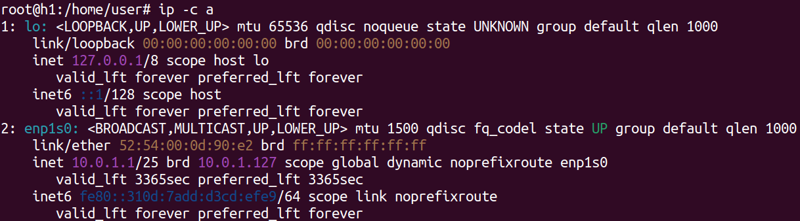
</p>

#### H2 setup
[comment]: <> (image = 3.png)
<p align="center">
  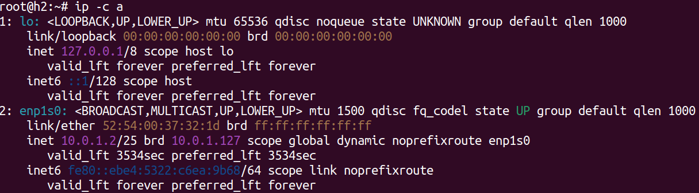
</p>

#### H3 setup
[comment]: <> (image = 4.png)
<p align="center">
  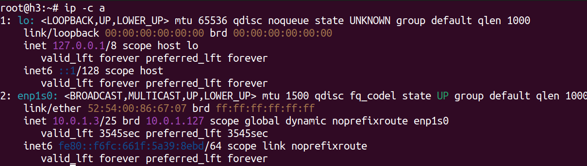
</p>

## ICMP protocol and the `ping` command

`ping` is a command-line software by which a user can generate ICMP messages. The ICMP as a protocol is commonly used for network debugging and troubleshooting. We are going to use ICMP as simple protocol for testing LAN connectivity and issues. Here it is an ICMP packet enacpsulated in an IPv4 packet

## IPv4 packet with ICMP inside
[comment]: <> (image = 5.png)
<p align="center">
  
</p>

The ICMP packet is comprised of a header (8 bytes) and a variable payload. Since the most used network layer protocol is IPv4, the overall size of an ICMP packet can not overflow __65.536 bytes__. Without options, `ping` creates an ICMP echo-request per second. The receiver is expected to send back an echo-reply. Here it is an output when pinging five times H2 (`10.0.1.2/25`) from H1 (`10.0.1.1/25`):

#### Output
[comment]: <> (image = 6.png)
<p align="center">
  
</p>

## ping output explained

When hitting `ping <target>`, the user is requesting the OS to have a new IPv4 packet and insert an ICMP echo-request on it. Then, the OS drives the NIC so that the packet is sent out from the system.

## ICMP payload generated

The ICMP payload size, that is the application layer data, is 56 bytes by default. However, 16 out of 56 bytes are used to store an instance of `struct timeval`. This piece of data is used to evaluete the RTT (Round Trip Time): how long the sender await before receiving an ICMP echo-reply message.

If the ICMP payload size is 56 bytes, the overall IPv4 packet is 84-bytes long: 20 bytes (IPv4 header) + 8 bytes (ICMP header) + 56 bytes (ICMP payload).This information is printed on the top of the trace: `PING [...] 56(84) [...]`

#### ping output header line
[comment]: <> (image = 7.png)
<p align="center">
  
</p>

## Sequence Number
Each line says: how many bytes the ICMP echo-reply packet is made of, the source of the packet, the __Sequence Number__, the IPv4 __TTL__, and how long the sender has awaited before receiving that reply.

#### ping output lines
[comment]: <> (image = 8.png)
<p align="center">
  
</p>

The __Sequence Number__ comes to play when a host sends multiple ICMP echo-request packets to another host. Because the replies may be received out-of-order, the sender target each ICMP echo-request with an ascending value. The receiver copies and pastes such a value in the __Sequence Number__  of the ICMP echo-reply. If there is a gap in the sequence numbers in the replies received, it indicates that some packets were lost along the way.

## Identifier

In the ICMP header, alongside the __Sequence Number__, there is also the __Identifier__. This field comes to play when multiple ping sessions are running concurrently. Each ping session can have a unique ICMP ID, which allows the sender to differentiate between the responses of different ping sessions.

The ICMP Identifier is particularly useful when multiple ping sessions are running concurrently. Each ping session can have a unique ICMP Identifier, which allows the sender to differentiate between the responses of different ping sessions.

  Notice that: both __Sequence Number__ and __Identifier__ are not standardized. As a result, they can be populated in either big endian (BE) or little endian (LE). There is no definitive way to tell which format it is in from the contents of the packet. Therefore, Wireshark shows up both presentations. Here it is an ICMP ehcho-request packet dump:

### Wireshark ICMP echo-request trace
[comment]: <> (image = 9.png)
<p align="center">
  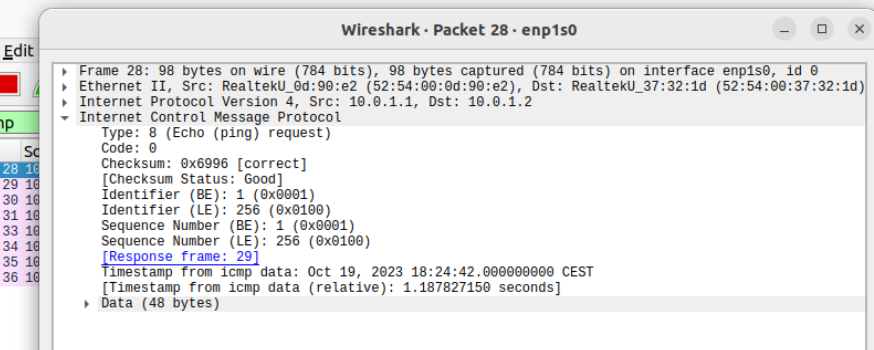
</p>

## ICMP time

As mentioned before, the ICMP payload default size is set to 56 bytes, but 16 out 56 bytes are used to store an instance of `struct timeval`. If the receiver simply copies and pastes the ICMP payload in the ICMP echo-reply, the sender can stamp the time at which it sends the request, so that when receiving the reply, it subtracts the timestamp in the packet from the current local time, and that is it: you get the RTT of any packet.


# Basic quora

### _What are the numbers `X`, `Y`, `Z` in the following output?_

```sh
H1: ping H2 -c 4
PING H2 (H2) X(Y) bytes of data.
Z bytes from H2: icmp_seq=1 ttl=64 time=18.6 ms
Z bytes from H2: icmp_seq=2 ttl=64 time=0.127 ms
Z bytes from H2: icmp_seq=3 ttl=64 time=0.127 ms
Z bytes from H2: icmp_seq=4 ttl=64 time=0.125 Wms
--- H2 ping statistics ---
4 packets transmitted, 4 received, 0% packet loss, time 2999ms
rtt min/avg/max/mdev = 0.125/4.758/18.656/8.024 ms
```

X tells you the ICMP payload size. Y tells you the overall size of the resulting IPv4 packet. Z tells you the overall size of the ICMP echo-reply packet.

----

### _How can the ping application report the `icmp_seq` ? Why there is such a header? What could happen if such header were not present?_ 

`icmp_seq` defines the __Sequence Number__, by which ping can determine if any packets were lost during transmission. If there is a gap in the sequence numbers in the replies received, it indicates that some packets were lost along the way. If such fiels were missing, the sender would have a hard time matching incoming replies to the corresponding requests. This could make it difficult to identify packet loss, calculate RTT, or determine which packets were dropped.

----

### _What is the `ttl` value? Is is the sender or receiver TTL? Who decide to use 64?_

`ttl` stands fro Time to Live, and it tells you how many hops the packet can traverse before getting discarded. This prevents you to waste bandwith because of any routing loop. It is up to the sender define such a value.

----

### _What does it change if you change the size of the requests using the `–s<size>` option? Which is the minimum size that allows ping to measure and report the `time` field? Why this is happening? If you were the programmer working on the implementation of a ping command, how would you implement the `time` measure?_

The option `–s<size>` allows you to have an ICMP payload size at will. Because of the timestamp, this value should be greater than 16 bytes, that it the size of a `struct timeval`.

----

### _What happens if H1 tries to ping a host that is not active but belonging to your subnet?_

If H1 still knows the MAC address of H2, H1 can generate successfully the ICMP echo-request: at kernel-space, the IP target address can be translated into a MAC address. However, since H2 is off-line, H1 doesn't see any ICMP echo-reply: we get a __100% of packet loss__.

If H1 doesn't know the MAC address of H2, before sending out the ICMP echo-request packets, H1 must brodcasts an ARP request. However, since H2 is off-line, no ARP replies show up. In the end, because of ARP failing, the ICMP layer returns a __Destination Host Unreacheable__.

----

### _What happens if H1 tries to ping a host that is not active and does NOT belong to your subnet? Is there any packet sent on the LAN? Which packets are those?_

If H2 doesn't belong to the H1's network, H1 uses its own default gateway. If so, the gateway can either forward the ICMP echo-request successfully or fail because there is no route configured for H2. If failing, the router returns a __Destination Net Unreacheable__, that is *'Sorry, I'm not able to solve this'*. Conversely, H1's traffic reaches effectively the H2's network, but H2 may either online or offline. If offline, I will get a __Destination Host Unreacheable__, because of the remote router has failed ARP, that is *'Sorry, H2 is sleeping or something else'*.


# Advanced quora


### _What happens when a host pings the broadcast address?_

Theoretically, the sender receives multiple replies coming from all the active hosts in the network, including itself. However, modern OSes by default ignores ICMP echo-requests whose destination address is the broadcast. In general, the brodcast address as well as the network address is reseverd, therefore it is suspicious. However, in Linux-based OS (like the one we are using), you can disable such safeguard, by altering the flag at `/proc/sys/net/ipv4/icmp_echo_ignore_broadcasts`. If you see 1, then the OS ignore ICMP packet whose destination address is the broadcast. Here it is what happens if disabled:

#### Wireshark trace
[comment]: <> (image = 10.png)
  <p align="center">
    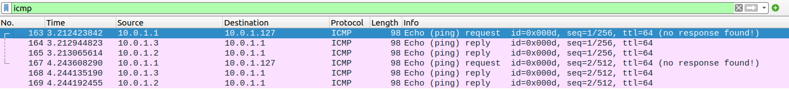
  </p>

You can clearly see the ICMP echo-replies coming back from the other two hosts plus the sender one. Yet, if sending an ICMP echo-request whose destination is the broadcast, the number of replies depends on the active hosts. If X, the sender gets X replies. As more the active hosts are, as more the sender fills its own bandwith with ICMP echo-replies message. As a result, the incoming traffic may be huge, and this is what an attacker exploits to force a DoS attack.

Notice that no ARP requests are sent, since any IPv4 broacast address is mapped onto `FF:FF:FF:FF:FF:FF` Ethernet address automatically!

----


### _What happens when a host pings the networking address?_

The networking address should never be used as unicast address, since it is reserved mainly for packet switching at network layer. If a host sends a packet to the networking address, tha OS discard the packet at the network layer.

# Advanced quora on duplicated addresses

Configure the LAN so that there are two hosts with the same IP address. Let's say H1 and H2 have `10.0.1.1/25`, while H3 still has `10.0.1.3/25`.

#### H1 setup
[comment]: <> (image = 2.png)
<p align="center">
  
</p>

#### H2 setup
[comment]: <> (image = 11.png)
<p align="center">
  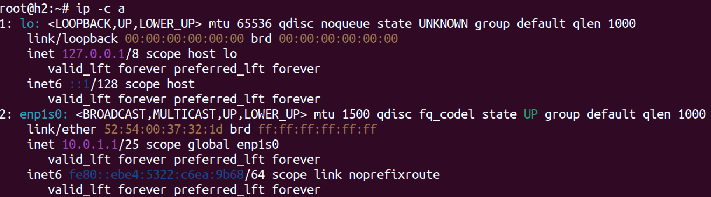
</p>

#### H3 setup
[comment]: <> (image = 4.png)
<p align="center">
  
</p>


### _What happens when H3 pings `10.0.1.1/25`, that is a duplicatd IP address in the LAN? Check the ARP tables of H1, H2, and H3_.

If two hosts are using the same IP address, then sooner or later one host or the other will broadcast an ARP Request. The result is an __ARP collision__, that is when two or more computers are responding to an ARP request with different answers: in other words, it is one IP address with two MACs.

When H3 looks for the MAC address of `10.0.1.1/25`, both H1 and H2 reply. H3 gets the messages, but just the first one is cached. After receiving an ARP Response for a specific IP address, the host that made the ARP Request ignores what it is following because the it has already obtained the desired association and does not need to update it until the ARP cache expires.

#### H3 ARP table 
[comment]: <> (image = 12.png)
<p align="center">
  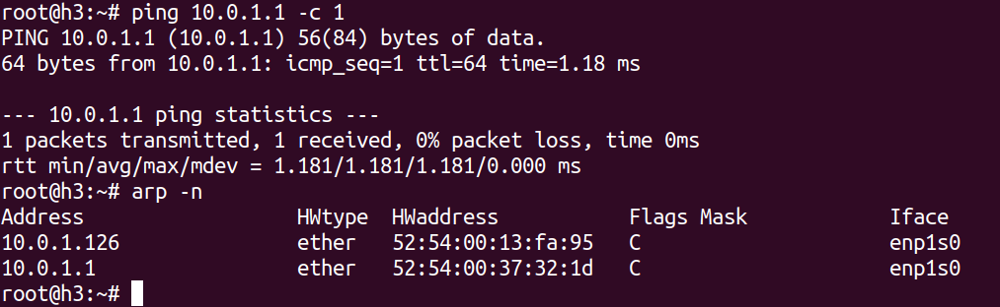
</p>

H3 relies on the MAC address `52:54:00:37:32:1d`, that is H2, while loses the race. 

### _What happens when H1 and H2 starts pinging H3 at the same time?_

Since H1 and H2 don't know the MAC address associated to `10.0.1.3/25`, they broadcast an ARP Request. H3 may receive the request coming from either H1 or H2 first. Therefore, H3 replies just the quickest one as before.


# Advanced quora on wrong network netmask

Configure the LAN so that H1 sees H2 as belonging to its subnet, but H2 does not sees H1 as not beloging to its subnet.

#### H1 setup
[comment]: <> (image = 13.png)
<p align="center">
  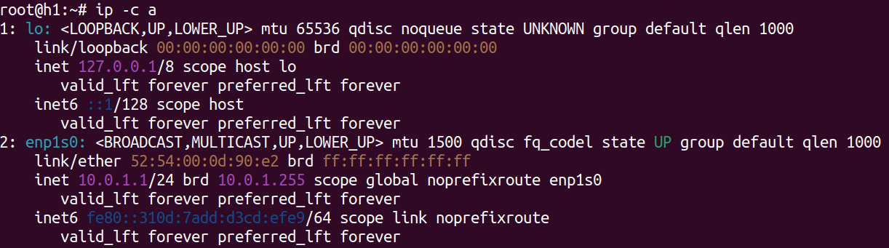
</p>

#### H1 routing table
[comment]: <> (image = 14.png)
<p align="center">
  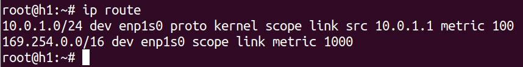
</p>


#### H2 setup
[comment]: <> (image = 15.png)
<p align="center">
  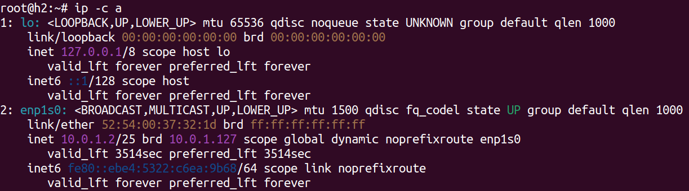
</p>

#### H2 routing table
[comment]: <> (image = 16.png)
<p align="center">
  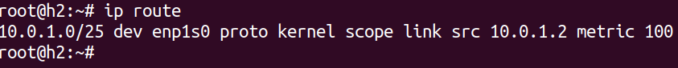
</p>


### _What happens when H1 pings H2? Which packets is H1 sending? Which packets is H2 sending? How do ARP tables of H1 and H2 change?_

According to the routing table, H1 is able to reach all the hosts from `10.0.1.1` up to `10.0.1.254`, while H1 can only reach the half, that is from `10.0.1.1` up to `10.0.1.126`. Now, there are two main scenarios:

1. If H1 has an IP address in between `10.0.1.1` and `10.0.1.126`, H1 and H2 can talk successfully. This what would happen if running the setup depicted in the images above.
2. If H1 has an IP address greater than `10.0.1.126`, H1 and H2 no longer talk as expected.

To be more precise, if H1 has an IP address which is greater than the brodcast address of the network H1 is attached to (let's say `10.0.1.129`), the miss-configuration shows up as H2 receiving an ARP Request from a host which is not inside the LAN. Conversely, if H1 has an IP address which is the broacast address of the network H1 is attached to, that is `10.0.1.127`, the miss-configuration shows up as H2 receiving an ARP Request from a reserved address: the brodcast address is not supposed to be there! In both cases, H2 doesn't reply at all, so ARP table of H1 reveals some missing info.

Overall, having H1 with an IP address either greater or equal `10.0.1.127` is a hazard, which further leads to have connectivity issues.

----

### _What happens when H2 pings H1? Which packets is H1 sending? Which packets is H2 sending? How do ARP tables of H1 and H2 change?_

If H2 "sees" H1, that is H1 having an IP address in the H2's network, H1 and H2 can talk successfully. Conversely, if H1 is out of scope, H2 gets an error from the OS that is __Destination Host Unreachable__, and no packets are sent over the LAN.

# Advanced quora on wrong netmask and conflict brodcast address

Configure the LAN so that

• H1 has address __172.16.0.127__ and netmask __255.255.255.0__

• H2 has address __172.16.0.1__ and netmask __255.255.255.128__

### H1 setup
[comment]: <> (image = 19.png)
<p align="center">
  
</p>

### H2 setup
[comment]: <> (image = 20.png)
<p align="center">
  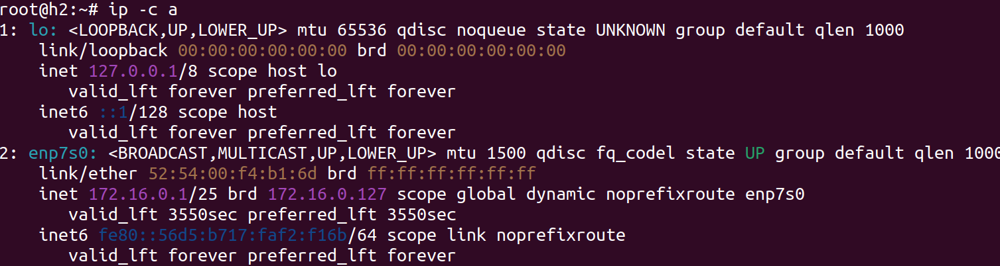
</p>

### _What happens when H1 pings H2? Which packets is H1 sending? Which packets is H2 sending? How do ARP tables of H1 and H2 change?_

This is the second scenario you saw before: H1 has an address which is the brodcast address of the network H2 is attached to. As before, since H1 doesn't know the MAC address of H2, it puts on the wire an ARP Request. However, the brodcast is never supposed to be a requestor, so H2 simply ignores them all. Because of ARP failing, H1 gets back a __Destination Host Unreachable__. In this condition, the ARP table of H2 doesn't get altered, while the ARP table of H1 claims for some missing info.

----

### _What happens when H2 pings H1? Which packets is H1 sending? Which packets is H2 sending? How do ARP tables of H1 and H2 change?_

H2 sees H1 as the brodcast address, so no ARP Request are sent out over the LAN. If so, H2 will never discover the MAC address of H1 at all. H2 just recevies replies from itself.