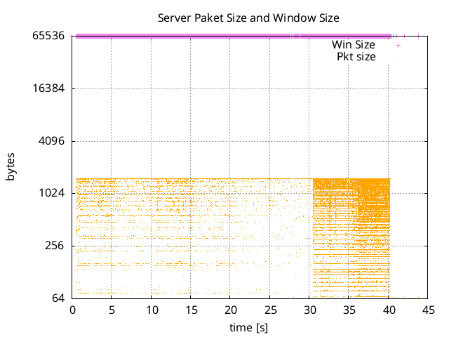

# TCP analysis with Chargen

The conducted experiment consists of the following operational steps:

1) Start telnet on the designated port for the Chargen service (instant 0);
2) Set the output terminal to maximum size (instant 5);
3) Set the output terminal to minimum size (instant 10);
4) Set the output terminal to maximum size again (instant 15);
5) Start telnet in parallel on a second terminal (instant 20);
6) Suppress output on the first terminal, with the use of CTRL+C (instant 25);
7) Suppress output on the second terminal, with the use of CTRL+C (instant 30);
8) Enter telnet command line on the first terminal (instant 35);
9) Enter telnet command line on the second terminal (instant 40);
10) Terminate telnet on the first terminal (instant 45);
11) Terminate telnet on the second terminal (instant 50);


## Sequence Number, Acknowledgment Number analysis

### Get started
Extract a CSV from Wireshark for the first 15 seconds, i.e. *frame.time_relative <= 15*, with the following columns info:

```csv
"Time","Length","Sequence Number","Acknowledgment Number"
"0.000070436","74","0","1",
"0.004956108","140","1","1"
"0.005010442","1514","75","1"
[...]
```

```bash
# Run this for extracting Time and Sequence Number fields
cat file.csv | tail -n +2 | cut -d "," -f1,3 | tr -d '"' | tr ',' '\t' > output_seq.txt
# Run this for extracting Time and Acknowledgment Number fields
cat file.csv | tail -n +2 | cut -d "," -f1,4 | tr -d '"' | tr ',' '\t' > output_ack.txt
```

## Server side (from 0 seconds to 15 seconds)

In the absence of retransmissions, the value grows continuously throughout the time period; however, in the period in which the terminal has the maximum size, the growth speed is more limited than in the period of time in which the terminal is at the minimum size, and this is due to the slowdown due to the countless system calls to print very many characters on the screen.

<p align="center">
  
</p>

From instant 5 to instant 10 (terminal at maximum size), the curve bends, growing less than it had done before. After that, from instant 10 to instant 15, it experiences a significantly increasing,and this happens when the terminal is reduced to the minimum size: to be expected.

#### Acknowledgment Number

<p align="center">
  
</p>

During the fist 15 seconds, the client is quiet; therefore, the server simply acknowledges the receipt of the last packet received, i.e. the ACK to the SYN-ACK that the server sent.

## Server side (from 15 seconds to 30 seconds)
#### Sequence Number

At time 15, the leftmost (the one relating to the first connection) bends downwards, and this is because the terminal window has been maximized again; at time 20, the second connection shows up; therefore, the two connections go in __parallel__ and the growth of the sequence numbers relating to the first connection is less than a few seconds before: it almost flatlines.

<p align="center">
  
</p>

After that, when hitting CTRL+C on the second terminal, i.e. instant 25, the lower curve rockets up. That is because of output suppressing.

#### Acknowledgment Number

The first client is quiet as before, so the server simply acknowledges the receipt of the last packet received, i.e. the ACK to the SYN-ACK that the server sent.

<p align="center">
  
</p>

The second client is no longer quiet at time 25, since it hits CTRL+C. So, the server acknowledges the receipt of 5 bytes, i.e. 0xFF F4 FF FD 06, and the acknowledgment number curve steps to 6.

<p align="center">
  
</p>


## Server side (from 30 seconds onward)
#### Sequence Number

At time 30, the first client hits CTRL+C; therefore, even in the first terminal the ouput is suppressedd. As a result, the leftmost curve, i.e. the fist connection, rockets up. At time 35, the first stops the remote service by hitting CTRL+], while the second client goes on. As a result, the righmost curve, i.e. the second connection, experiences a visible growth. 

<p align="center">
  
</p>

At time 40, the server no longer send any Chargen ouput, since the service has been shutdown by both the clients, and the sequence number gets rarer.

#### Acknowledgment Number

At time 30, the first client hits CTRL+C on terminal. So, the server acknowledges the receipt of 5 bytes, i.e. 0xFF F4 FF FD 06, and the acknowledgment number curve steps to 6.

<p align="center">
  
</p>

Conversely, the second client keeps receiving packet for client form the server with acknowledgment number set to 6.

<p align="center">
  
</p>

At time 40 and time 50, the two clients terminate the TCP session respectively, putting an end to the data exchange. The last acknowledgment number for both, by the server, is therefore equal to 7.

<p align="center">
  
</p>

## Clients Side

The curve on the left represents the evolution of the acknowledgment numbers linked to the first connection, while the curve on the right represents the second connection. Naturally, the overall behavior is comparable to the sequence number evolution of the server for both the first and the second connection.

<p align="center">
  
</p>

Simultaneously, the sequence number's progression resembles the acknowledgment from the server. Notice the two progressions overlap at roughly 30 seconds!

<p align="center">
  
</p>


## Window and packet sizes analysis

### Get started
Extract a CSV from Wireshark with the following inf inside:

```csv
"Time","Length","Calculated Window Size"
"0.000451676","66","64256"
"0.570665919","66","64256"
[...]
```

```bash
# Run this for extracting Time and Length
cat file.csv | tail -n +2 | cut -d "," -f1,2 | tr -d '"' | tr ',' '\t' > output_pktlength.txt
# Run this for extracting Time and Calculated Window Size
cat file.csv | tail -n +2 | cut -d "," -f1,3 | tr -d '"' | tr ',' '\t' > output_winsize.txt
```

## Server Side
The server's reception window stays at 65536 bytes for both the first and second connections, but the average size of the sent packets averages the maximum size, or 1514 bytes for an MTU of 1500 bytes. Conversely, when the clients suppress the output, there is a very dense packet distribution, which indicates a very frequent data exchange.

<p align="center">
  
</p>

It is clear for both the first connection and the second that there is a very noticeable acceleration starting from the moment both clients pressed CTRL+C.

<p align="center">
  
</p>

## Clients Side
The reception window of the first client exhibits fluctuating behavior, due to the numerous episodes in which the size of the receiving buffer becomes 0. The reception window reaches its maximum size in the period in which the output on the terminal is suppressed. 

<p align="center">
  
</p>

Same thing for the second client.

<p align="center">
  
</p>

It is typical for both clients' packet sizes to be about 64 bytes, or the size of a TCP packet without a payload. TCP packets with options are the reason for several exceptions.